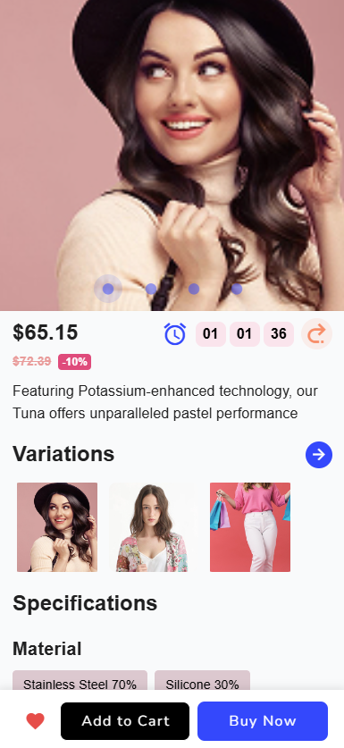
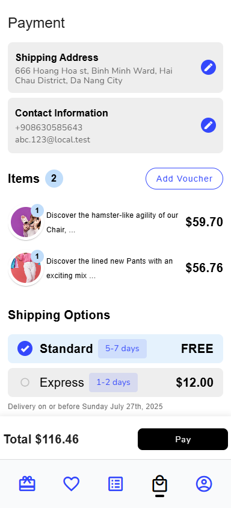
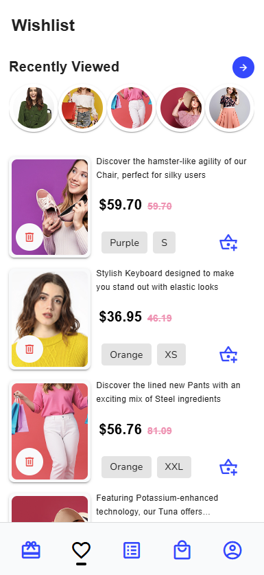

# 👗 E-Commerce Fashion Mobile App

A modern, responsive e-commerce fashion application built with **Nuxt.js 3**, **Vue 3**, **Vuetify**, and **Tauri** for cross-platform mobile deployment. This project demonstrates full-stack e-commerce capabilities with a mobile-first approach.

## 🚀 Live Demo

- **Web App**: [Live Demo](https://cuongdinhngo.github.io/ecom-fashion)

## 📱 Screenshots

| Home Screen | Product Details | Shopping Cart | Wishlist |
|-------------|-----------------|---------------|----------|
|  |  |  |  |

## ✨ Features

### 🛍️ **E-Commerce Core**
- **Product Catalog** with categories and filtering
- **Advanced Search** with multiple filters (price, category, size, color)
- **Shopping Cart** with quantity management
- **Wishlist** functionality
- **Order Management** and tracking
- **User Profiles** and order history
- **Voucher System** with discount codes

### 📱 **Mobile-First Design**
- **Responsive UI** with Vuetify Material Design
- **Touch-optimized** interactions
- **Progressive Web App** (PWA) capabilities
- **Native Mobile App** via Tauri (Android/iOS)

### 🔧 **Technical Features**
- **Vue 3 Composition API** for modern reactive programming
- **TypeScript** for type safety
- **State Management** via Nuxt composables
- **Local Storage** persistence
- **Real-time Search** and filtering
- **Optimized Performance** with lazy loading

## 🛠️ Tech Stack

### **Frontend**
- **[Nuxt.js 3](https://nuxt.com/)** - Vue.js framework with SSR/SSG
- **[Vue 3](https://vuejs.org/)** - Progressive JavaScript framework
- **[Vuetify](https://vuetifyjs.com/)** - Material Design component library
- **[TypeScript](https://www.typescriptlang.org/)** - Type-safe JavaScript
- **[VueUse](https://vueuse.org/)** - Collection of Vue composition utilities

### **Mobile Development**
- **[Tauri](https://tauri.app/)** - Cross-platform app framework
- **[Rust](https://www.rust-lang.org/)** - Systems programming language for native performance

### **Development Tools**
- **[Bun](https://bun.sh/)** - Fast JavaScript runtime and package manager
- **[Sass](https://sass-lang.com/)** - CSS preprocessor
- **[ESLint](https://eslint.org/)** - Code linting

## 📋 Prerequisites

### **For Web Development**
- **Node.js** 18+ or **Bun** runtime
- Modern web browser

### **For Android Development**
- **Android Studio** with Android SDK
- **Java Development Kit (JDK)** 17+
- **Rust** toolchain
- **Android NDK** 29.0.13599879+
- **Windows Developer Mode** enabled (for Windows users)

## 🚀 Quick Start

### **1. Clone the Repository**
```bash
git clone https://github.com/cuongdinhngo/ecom-fashion.git
cd ecom-fashion
```

### **2. Install Dependencies**
```bash
# Using Bun (recommended)
bun install

# Or using npm
npm install

# Or using pnpm
pnpm install

# Or using yarn
yarn install
```

### **3. Start Development Server**
```bash
# Using Bun
bun dev

# Or using npm
npm run dev

# Or using pnpm
pnpm dev

# Or using yarn
yarn dev
```

Open [http://localhost:3000](http://localhost:3000) in your browser.

## 📱 Android Development

### **Environment Setup**

1. **Install Android Studio**
   - Download from [Android Studio](https://developer.android.com/studio)
   - Install Android SDK, Platform-Tools, and Build-Tools
   - Install Android NDK (version 29.0.13599879)

2. **Set Environment Variables** (Windows PowerShell)
   ```powershell
   $env:ANDROID_HOME = "$env:LOCALAPPDATA\Android\Sdk"
   $env:ANDROID_NDK_ROOT = "$env:LOCALAPPDATA\Android\Sdk\ndk\29.0.13599879"
   ```

3. **Enable Developer Mode** (Windows)
   - Settings → Update & Security → For developers → Developer Mode

### **Build Android App**

1. **Build Web Assets**
   ```bash
   bun run build
   ```

2. **Build Android APK (Debug)**
   ```bash
   bun tauri android build --debug
   ```

3. **Build Android APK (Release)**
   ```bash
   bun tauri android build --release
   ```

### **Android Emulator**

1. **Start Emulator (Quick)**
   ```bash
   # Use provided script
   powershell -ExecutionPolicy Bypass -File "start-emulator.ps1"
   
   # Or use batch file
   start-emulator.bat
   ```

2. **Start Emulator (Manual)**
   ```bash
   # List available AVDs
   emulator -list-avds
   
   # Start specific emulator
   emulator -avd Medium_Phone_API_36.0
   ```

3. **Install & Test APK**
   ```bash
   # Check connected devices
   adb devices
   
   # Install debug APK
   adb install -r "src-tauri\gen\android\app\build\outputs\apk\universal\debug\app-universal-debug.apk"
   
   # Launch the app
   adb shell am start -n com.ecomfashion.mobile/com.ecomfashion.mobile.MainActivity
   ```

## 🏗️ Build & Deployment

### **Web Deployment**
```bash
# Build for production
bun run build

# Preview production build locally
bun run preview

# Generate static files (for static hosting)
bun run generate
```

### **Production Android Build**
```bash
# Clean build
bun tauri android build --release

# Sign APK (for Play Store)
# Follow Android signing documentation
```

## 📁 Project Structure

```
ecom-fashion/
├── 📁 components/          # Vue components
│   ├── 📁 chat/           # Chat interface components
│   ├── 📁 form/           # Form input components
│   ├── 📁 items/          # Product & UI item components
│   ├── 📁 profile/        # User profile components
│   ├── 📁 shop/           # Shopping components
│   └── 📁 sections/       # Page sections
├── 📁 composables/        # Vue composables (state management)
├── 📁 layouts/            # Nuxt layouts
├── 📁 pages/              # File-based routing
├── 📁 public/             # Static assets
├── 📁 src-tauri/          # Tauri native app configuration
├── 📁 storage/            # Local data storage
├── 📁 utils/              # Utility functions
├── 📄 nuxt.config.ts      # Nuxt configuration
├── 📄 tauri.conf.json     # Tauri configuration
└── 📄 package.json        # Dependencies and scripts
```

## 🎯 Key Components

### **State Management**
- `useCart()` - Shopping cart management
- `useWishlist()` - Wishlist functionality
- `useProducts()` - Product catalog and search
- `useOrders()` - Order management
- `useSearchQuery()` - Search state management

### **Core Features**
- **Product Catalog** with dynamic filtering
- **Shopping Cart** with persistent storage
- **User Authentication** simulation
- **Order Tracking** with status updates
- **Responsive Design** for all screen sizes

## 🔧 Development Scripts

```bash
# Development
bun dev                    # Start dev server
bun build                  # Build for production
bun preview               # Preview production build

# Android Development
bun tauri android init     # Initialize Android project
bun tauri android dev     # Android development mode
bun tauri android build   # Build Android APK

# Maintenance
bun lint                  # Code linting
bun type-check           # TypeScript checking
```

---

## 👨‍💻 Author

**Cuong Dinh Ngo**
- 🌐 Portfolio: [cuongdinhngo.github.io](https://cuongdinhngo.github.io/)
- 💼 GitHub: [@cuongdinhngo](https://github.com/cuongdinhngo)
- 📧 Email: dinhcuongngo@gmail.com
- 💬 LinkedIn: [Connect with me](https://www.linkedin.com/in/ngodinhcuong/)

---

**Built with ❤️ by [Cuong Dinh Ngo](https://cuongdinhngo.github.io/)**
